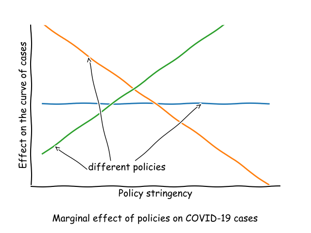

# covid-policy-analysis

Builds a framework to easily analyze the relationship between different policy types and the change in COVID-19 cases for any given country.

Takes data from:
- The [Oxford Covid-19 Government Response Tracker (OxCGRT)](https://github.com/OxCGRT/covid-policy-tracker) for data on policy implementation.
- The [COVID-19 Data Repository](https://github.com/CSSEGISandData/COVID-19) by the Center for Systems Science and Engineering (CSSE) at Johns Hopkins University for data on daily number of cases, deaths and recoveries.

## Rationale

The basic idea is that some policies should have had a major impact on the containment of the virus while others were probably not as relevant.

Government policies are assigned a coefficient that represents the correlation with the **decrease** in the number of cases.

## Structure

- The file `eda.ipynb` describes the source data sets and their preprocessing.
- The file `linear-analysis.ipynb` explores different linear models and other predictors trying to find the most adequate fit.